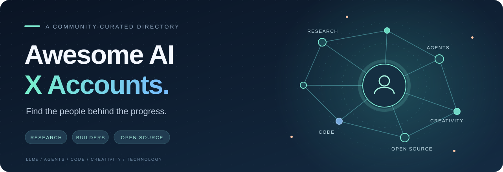

<!-- Generated by scripts/catalog.py. Edit data, locales, or templates. -->
<a id="top"></a>

**English** · [简体中文](README.zh-CN.md) · [한국어](README.ko.md) · [日本語](README.ja.md) · [Русский](README.ru.md) · [Français](README.fr.md) · [Español](README.es.md)

<p align="center">
  
</p>

<h1 align="center">Awesome AI X Accounts</h1>

<p align="center"><strong>AI · LLMs · Agents · Technology</strong></p>

<p align="center">
  <a href="#directory">Browse accounts</a> ·
  <a href="CONTRIBUTING.md">Add an account</a>
</p>

<p align="center">
  
</p>

A categorized directory of public X accounts about AI and technology.

**130 accounts · 11 categories · 7 languages**

Profile snapshot: **2026-09-14 (UTC)**. Bios are copied in their original language. Followers are a snapshot; “—” means unavailable or an empty bio.

<a id="directory"></a>

## 🗂️ Categories

| Category | Accounts |
| --- | ---: |
| [🧠 AI research](#research) | 17 |
| [📚 LLMs &amp; learning](#llm) | 11 |
| [🤖 Agents &amp; evaluation](#agents) | 10 |
| [💻 AI coding &amp; development](#coding) | 11 |
| [⚙️ Open source &amp; infrastructure](#infra) | 14 |
| [🎬 Image, video &amp; audio](#creative) | 9 |
| [🦾 Robotics &amp; spatial AI](#robotics) | 10 |
| [🚀 Products &amp; founders](#founders) | 16 |
| [🌏 Chinese-language AI &amp; tech](#chinese) | 9 |
| [🏛️ Labs &amp; model teams](#labs) | 14 |
| [📰 Media, interviews &amp; explainers](#media) | 9 |

<a id="research"></a>

## 🧠 AI research

| Account | X profile bio | Followers |
| --- | --- | ---: |
| **Andrew Ng**<br />[@AndrewYNg](https://x.com/AndrewYNg) | Co-Founder of Coursera; Stanford CS adjunct faculty. Former head of Baidu AI Group/Google Brain. #ai #machinelearning, #deeplearning #MOOCs | 1.9M |
| **Demis Hassabis**<br />[@demishassabis](https://x.com/demishassabis) | Nobel Laureate. Co-Founder &amp; Chair @GoogleDeepMind; Chief Scientist of Alphabet. Founder &amp; CEO @IsomorphicLabs. Building the future... | 1.9M |
| **Fei-Fei Li**<br />[@drfeifei](https://x.com/drfeifei) | Cofounder/CEO @theworldlabs, Prof (CS @Stanford), Co-Director @StanfordHAI, #AI #SpatialIntelligence #GenAI #computervision #robotics #AI-healthcare | 1.1M |
| **fast.ai**<br />[@fastdotai](https://x.com/fastdotai) | Deep learning R&amp;D: https://t.co/cGBcDU8wJ9;<br />Education: https://t.co/bNXBttRAuR;<br />Software: https://t.co/0z7Ws3SHDt;<br />Book: https://t.co/lVEDyioBtg;<br />@math\_rachel @jeremyphoward | 128.4K |
| **François Chollet**<br />[@fchollet](https://x.com/fchollet) | Co-founder @ndea. Co-founder @arcprize. Creator of Keras and ARC-AGI. Author of 'Deep Learning with Python'. | 729.3K |
| **Geoffrey Hinton**<br />[@geoffreyhinton](https://x.com/geoffreyhinton) | deep learning | 651.9K |
| **Ian Goodfellow**<br />[@goodfellow\_ian](https://x.com/goodfellow_ian) | Co-founder of stealth startup. Inventor of GANs. Lead author of https://t.co/M6vl8pEQ4I Founding chairman of @pubhealthaction | 380.7K |
| **hardmaru**<br />[@hardmaru](https://x.com/hardmaru) | Co-Founder and CEO @SakanaAILabs 🎏 | 434.7K |
| **Ilya Sutskever**<br />[@ilyasut](https://x.com/ilyasut) | SSI @SSI | 898.5K |
| **Jack Clark**<br />[@jackclarkSF](https://x.com/jackclarkSF) | @AnthropicAI, writer @ Import AI.  <br />Past: @openai, @business @theregister. <br />Neural nets, distributed systems, weird futures. | 146.2K |
| **Jeff Dean**<br />[@JeffDean](https://x.com/JeffDean) | Co-founder &amp; CEO of Discovery Loop. Former Chief Scientist, Google. Helped build many Google products, TPUs, Gemini, TensorFlow, MapReduce, Bigtable, ... | 521.5K |
| **Jeremy Howard**<br />[@jeremyphoward](https://x.com/jeremyphoward) | 🇦🇺 Co-founder: @AnswerDotAI/@FastDotAI ;<br />Prev: Professor@UQ; @kaggle founding president; founder @fastmail/@enlitic/…<br />https://t.co/16UBFTX7mo | 328.4K |
| **Andrej Karpathy**<br />[@karpathy](https://x.com/karpathy) | deep learning | 4.2M |
| **LMSYS Org**<br />[@lmsysorg](https://x.com/lmsysorg) | Large Model Systems Organization: We developed SGLang @sgl\_project (https://t.co/OjwQadINKU), Chatbot Arena (now @arena), and Vicuna! | 17.3K |
| **Melanie Mitchell**<br />[@MelMitchell1](https://x.com/MelMitchell1) | Professor, Santa Fe Institute.  Mostly posting  on https://t.co/4NpA2IL5Va (at-melaniemitchell). More thoughts at https://t.co/nC43NHRozX. | 52K |
| **Tri Dao**<br />[@tri\_dao](https://x.com/tri_dao) | Asst. Prof @PrincetonCS, Chief Scientist @togethercompute. Machine learning &amp; systems. | 44.6K |
| **Yann LeCun**<br />[@ylecun](https://x.com/ylecun) | Founder/Chair, AMI Labs; Professor, NYU; Partner, 224 Ventures; Ex-Chief AI Scientist, Meta.<br />Researcher in AI, ML, Robotics, etc.<br />ACM Turing Award Laureate. | 1.3M |

[↑ Back to categories](#directory)

<a id="llm"></a>

## 📚 LLMs &amp; learning

| Account | X profile bio | Followers |
| --- | --- | ---: |
| **Claude**<br />[@claudeai](https://x.com/claudeai) | Claude is an AI assistant built by @anthropicai to be safe, accurate, and secure. Talk to Claude on https://t.co/ZhTwG8d1e5 or download the app. | 1.8M |
| **Yao Fu**<br />[@Francis\_YAO\_](https://x.com/Francis_YAO_) | Prev. Grok 4.5/4.6 pretraining scaling @xAI; Gemini 3 perception and project Astra @GoogleDeepMind | 23.5K |
| **Jay Alammar**<br />[@JayAlammar](https://x.com/JayAlammar) | Machine Learning Researcher and writer https://t.co/5GlbofAHs0. O'Reilly Author https://t.co/Fl3uPAZHLg. LLM Builder @Cohere. | 52.1K |
| **Lilian Weng**<br />[@lilianweng](https://x.com/lilianweng) | MTS @OpenAI; Author of Lil'Log<br /><br />Prev: Ex Co-founder of Thinking Machines Lab; Ex-VP, AI Safety &amp; robotics, applied research OpenAI | 292.8K |
| **Nathan Lambert**<br />[@natolambert](https://x.com/natolambert) | Open model research @ something new.<br />Prev. co-led Olmo at Ai2.<br />Writes @interconnectsai, wrote https://t.co/alRXKINTwE | 101K |
| **elvis**<br />[@omarsar0](https://x.com/omarsar0) | Founder @dair\_ai • Prev: Meta AI \| PhD • Learn Harness Engineering here: https://t.co/nOPcXIaITT | 319.4K |
| **Perplexity**<br />[@perplexity\_ai](https://x.com/perplexity_ai) | Curiosity changes everything. Download our free app on iOS, Mac, Windows, and Android. | 504.7K |
| **Sebastian Raschka**<br />[@rasbt](https://x.com/rasbt) | ML/AI research engineer. Ex stats professor.<br />Author of "Build a Large Language Model From Scratch" (https://t.co/O8LAAMRzzW) &amp; reasoning (https://t.co/5TueQKx2Fk) | 507.4K |
| **Sebastian Ruder**<br />[@seb\_ruder](https://x.com/seb_ruder) | Research Scientist @AIatMeta MSL • Ex @Cohere @GoogleDeepMind | 98.5K |
| **Luis Serrano**<br />[@SerranoAcademy](https://x.com/SerranoAcademy) | Author of Grokking Machine Learning, ML and QC popularizer, YouTuber: https://t.co/MGCYjf6M9K, Opinions are my own https://t.co/S1jvXnAa8U | 12.3K |
| **Sasha Rush**<br />[@srush\_nlp](https://x.com/srush_nlp) | Researcher, Programmer <br />https://t.co/cZl0wTfqGz | 84.3K |

[↑ Back to categories](#directory)

<a id="agents"></a>

## 🤖 Agents &amp; evaluation

| Account | X profile bio | Followers |
| --- | --- | ---: |
| **Chip Huyen**<br />[@chipro](https://x.com/chipro) | @aisysbooks @goodailist<br />AI Engineering: https://t.co/94dv4uTU1H<br />Designing MLSys: https://t.co/G81hL2dWmr<br />Reading @chipslib | 146.7K |
| **Cognition**<br />[@cognition](https://x.com/cognition) | Makers of Devin, the first AI software engineer. We are an applied AI lab building end-to-end software agents. Join us: https://t.co/4Ss9hvpjRG | 182K |
| **Eugene Yan**<br />[@eugeneyan](https://x.com/eugeneyan) | MTS @AnthropicAI. Prev: Principal Applied Scientist @Amazon, led ML @ Alibaba, Healthtech startup. | 29.2K |
| **Hamel Husain**<br />[@HamelHusain](https://x.com/HamelHusain) | Evals Evals Evals -  https://t.co/Zrmp6LRd9c<br /><br />About Me: https://t.co/P6WyeKkyTa | 55.6K |
| **Harrison Chase**<br />[@hwchase17](https://x.com/hwchase17) | @LangChain<br /><br />Always hiring: https://t.co/D5Ut3loFO7 | 130.8K |
| **Jerry Liu**<br />[@jerryjliu0](https://x.com/jerryjliu0) | Parsing the world's hardest PDFs @llama\_index. cofounder/CEO<br /><br />Careers: https://t.co/EUnMNmbCtx<br />Enterprise: https://t.co/Ht5jwxSrQB | 83.7K |
| **jason**<br />[@jxnlco](https://x.com/jxnlco) | vibes @openai | 131.5K |
| **Shreya Shankar**<br />[@sh\_reya](https://x.com/sh_reya) | Incoming assistant professor @CSDatCMU @CMUDB. All about data, HCI, and AI. Created https://t.co/PmuOqAXVgS and https://t.co/8MQt4na2cj. | 55.9K |
| **Simon Willison**<br />[@simonw](https://x.com/simonw) | Creator @datasetteproj, co-creator Django. PSF board. Hangs out with @natbat. He/Him. Mastodon: https://t.co/t0MrmnJW0K Bsky: https://t.co/OnWIyhX4CH | 222.3K |
| **swyx**<br />[@swyx](https://x.com/swyx) | achieve ambition with intentionality, intensity, integrity &amp; insanity.<br /><br />affiliations:<br />- @smol\_ai<br />- @dxtipshq<br />- @cognition<br />- @aidotengineer<br />- @latentspacepod | 192K |

[↑ Back to categories](#directory)

<a id="coding"></a>

## 💻 AI coding &amp; development

| Account | X profile bio | Followers |
| --- | --- | ---: |
| **Aman Sanger**<br />[@amanrsanger](https://x.com/amanrsanger) | Building @SpaceXAI \| @cursor\_ai founder | 57.5K |
| **Boris Cherny**<br />[@bcherny](https://x.com/bcherny) | Claude Code @anthropicai | 573.4K |
| **Cursor**<br />[@cursor\_ai](https://x.com/cursor_ai) | Coding agent for building ambitious software | 482.2K |
| **Lee Robinson**<br />[@leerob](https://x.com/leerob) | Model behavior @SpaceXAI. Helping train useful models. | 287.6K |
| **Matt Shumer**<br />[@mattshumer\_](https://x.com/mattshumer_) | AI whisperer. Investor in @GroqInc @Etched @Rork @DaytonaIO @OpenRouter + more. Prev: CEO @HyperWriteAI \| AI @AlphaSchool<br /><br />Press: mattshumermedia@gmail.com | 395.1K |
| **Michael Truell**<br />[@mntruell](https://x.com/mntruell) | Building @SpaceXAI | 228.5K |
| **Hassan**<br />[@nutlope](https://x.com/nutlope) | Developer Experience Lead @togethercompute. Building open source AI apps like https://t.co/f8hbvXOFaN, https://t.co/SmHisRTtnp, &amp; https://t.co/hs63SlHxjw. | 99.5K |
| **Guillermo Rauch**<br />[@rauchg](https://x.com/rauchg) | @vercel CEO | 867.1K |
| **Sarah Drasner**<br />[@sarah\_edo](https://x.com/sarah_edo) | Opinions my own. Area Tech Lead, AI and Web Ecosystem @chrome, Formerly Sr. Director of Core Infra @google • O'Reilly Author • https://t.co/HhzYWwxqL9 | 303.8K |
| **Peter Steinberger 🦞**<br />[@steipete](https://x.com/steipete) | Polyagentmorous ClawFather. Came back from retirement to mess with AI and help a lobster take over the world.<br />@OpenClaw🦞 + @OpenAI | 587.4K |
| **Thariq**<br />[@trq212](https://x.com/trq212) | Claude Code @anthropicai. prev YC W20, @spc, @medialab | 342.3K |

[↑ Back to categories](#directory)

<a id="infra"></a>

## ⚙️ Open source &amp; infrastructure

| Account | X profile bio | Followers |
| --- | --- | ---: |
| **anton**<br />[@abacaj](https://x.com/abacaj) | Software, working on https://t.co/wPa5iIk1d3 - browsers for agents | 48.4K |
| **Georgi Gerganov**<br />[@ggerganov](https://x.com/ggerganov) | 24th at the Electrica puzzle challenge \| building https://t.co/baTQS2bL7I \| engineer @huggingface | 71.5K |
| **Gradio**<br />[@Gradio](https://x.com/Gradio) | Build and share machine learning apps in 3 lines of Python. Part of the @Huggingface family 🤗. <br />DMs are open for sharing your gradio app with us for promotion! | 57.6K |
| **Hugging Face**<br />[@huggingface](https://x.com/huggingface) | The AI community building the future. https://t.co/TpiXQMQ9rZ | 791.1K |
| **LangChain**<br />[@LangChain](https://x.com/LangChain) | Own your intelligence.<br /><br />Makers of LangSmith, @LangChain\_OSS, and @LangChain\_JS. | 264.8K |
| **LlamaIndex 🦙**<br />[@llama\_index](https://x.com/llama_index) | The most accurate agentic OCR platform for production AI.<br /><br />LlamaParse: https://t.co/yQGTiRSNvj<br />Docs: https://t.co/us6GCS1Clb | 120K |
| **ollama**<br />[@ollama](https://x.com/ollama) | https://t.co/1JpLwJ9Bdv | 183.1K |
| **PyTorch**<br />[@PyTorch](https://x.com/PyTorch) | Tensors and neural networks in Python with strong hardware acceleration. PyTorch is an open source project at the Linux Foundation. #PyTorchFoundation | 512K |
| **Soumith Chintala**<br />[@soumithchintala](https://x.com/soumithchintala) | Building new things @thinkymachines.  Also dabble in robotics at NYU.  Cofounded @PyTorch. AI is delicious when it is accessible and open-source. | 323.6K |
| **Teknium 🪽**<br />[@Teknium](https://x.com/Teknium) | Cofounder and Lead Engineer - Hermes Agent @NousResearch, prev @StabilityAI<br />Github: https://t.co/LZwHTUFwPq<br />HuggingFace: https://t.co/sN2FFU8PVE | 126.8K |
| **TensorFlow**<br />[@TensorFlow](https://x.com/TensorFlow) | TensorFlow is a fast, flexible, and scalable open-source machine learning library for research and production. | 375.6K |
| **Thomas Wolf**<br />[@Thom\_Wolf](https://x.com/Thom_Wolf) | co-founder @HuggingFace - moonshots | 132.4K |
| **vLLM**<br />[@vllm\_project](https://x.com/vllm_project) | A high-throughput and memory-efficient inference and serving engine for LLMs. Join https://t.co/lxJ0SfX5pJ to discuss together with the community! | 49.3K |
| **Weights &amp; Biases**<br />[@wandb](https://x.com/wandb) | The AI developer platform by @CoreWeave. | 49K |

[↑ Back to categories](#directory)

<a id="creative"></a>

## 🎬 Image, video &amp; audio

| Account | X profile bio | Followers |
| --- | --- | ---: |
| **Alex Volkov**<br />[@altryne](https://x.com/altryne) | 🎙️ Host of @thursdai\_pod (get your AI news with us!) <br />✨ AI Evangelist with @wandb &amp; @coreweave 🪄🐝 <br />Opinions my own | 42.1K |
| **camenduru**<br />[@camenduru](https://x.com/camenduru) | building 🍞 @tost\_ai ❤ open source https://t.co/8MMNbygz1P | 21.1K |
| **Alexander Doria**<br />[@Dorialexander](https://x.com/Dorialexander) | building open ai infrastructure @pleiasfr — χαλεπὰ τὰ καλά | 24.4K |
| **ElevenLabs**<br />[@ElevenLabs](https://x.com/ElevenLabs) | AI research and products that transform how we interact with technology. <br /><br />Leading foundational models powering ElevenAgents, @ElevenCreative, and ElevenAPI. | 190.4K |
| **fofr**<br />[@fofrAI](https://x.com/fofrAI) | Whispering to models at Google DeepMind | 82.7K |
| **apolinario (poli)**<br />[@multimodalart](https://x.com/multimodalart) | ML Engineer for Art and Creativity @HuggingFace | 16.2K |
| **Pika**<br />[@pika\_labs](https://x.com/pika_labs) | Tools for creation that happen to be AI<br /><br />https://t.co/G5bjmrMiCZ<br />Join our teams? https://t.co/wM9WYPvPZj | 150.9K |
| **Replicate**<br />[@replicate](https://x.com/replicate) | Run AI with an API | 53K |
| **Runway**<br />[@runwayml](https://x.com/runwayml) | Building AI to simulate the world. We're hiring: https://t.co/Grh4tTfq8y | 291.2K |

[↑ Back to categories](#directory)

<a id="robotics"></a>

## 🦾 Robotics &amp; spatial AI

| Account | X profile bio | Followers |
| --- | --- | ---: |
| **1X**<br />[@1x\_tech](https://x.com/1x_tech) | NEO The Home Robot \| Order Today | 145.4K |
| **Boston Dynamics**<br />[@BostonDynamics](https://x.com/BostonDynamics) | — | 336.2K |
| **Chelsea Finn**<br />[@chelseabfinn](https://x.com/chelseabfinn) | Asst Prof of CS &amp; EE @Stanford<br />Co-founder of Physical Intelligence @physical\_int<br />PhD from @Berkeley\_EECS, EECS BS from @MIT | 102.2K |
| **Jim Fan**<br />[@DrJimFan](https://x.com/DrJimFan) | NVIDIA Director of Robotics &amp; Distinguished Scientist. Co-Lead of GEAR lab. Solving Physical AGI, one motor at a time. Stanford Ph.D. OpenAI's 1st intern. | 587.6K |
| **Figure**<br />[@Figure\_robot](https://x.com/Figure_robot) | Figure is an AI Robotics company building the world's first commercially viable autonomous humanoid robot. | 212.5K |
| **Google DeepMind**<br />[@GoogleDeepMind](https://x.com/GoogleDeepMind) | The engine room of @Google. Building AI safely and responsibly to solve the world’s most complex problems. Join us: https://t.co/jUHQA27iBL | 1.5M |
| **Karol Hausman**<br />[@hausman\_k](https://x.com/hausman_k) | @Physical\_int | 44.4K |
| **Physical Intelligence**<br />[@physical\_int](https://x.com/physical_int) | Physical Intelligence (Pi), bringing AI into the physical world. | 49.7K |
| **Sergey Levine**<br />[@svlevine](https://x.com/svlevine) | Associate Professor at UC Berkeley<br />Co-founder, Physical Intelligence | 136.9K |
| **Unitree**<br />[@UnitreeRobotics](https://x.com/UnitreeRobotics) | High performance civilian robot manufacturer.<br />Please everyone be sure to use the robot in a Friendly and Safe manner.<br />https://t.co/hI6LafokVm | 149.5K |

[↑ Back to categories](#directory)

<a id="founders"></a>

## 🚀 Products &amp; founders

| Account | X profile bio | Followers |
| --- | --- | ---: |
| **a16z**<br />[@a16z](https://x.com/a16z) | It's time to build.<br /><br />https://t.co/A9eTFq6Xbx<br /><br />Posts are not investment advice or an advertisement for investment services. See https://t.co/nX2FtaLE06. | 1.1M |
| **Amjad Masad**<br />[@amasad](https://x.com/amasad) | ceo @replit. civilizationist | 490.4K |
| **Aravind Srinivas**<br />[@AravSrinivas](https://x.com/AravSrinivas) | cofounder and ceo @perplexity\_ai | 1.1M |
| **clem 🤗**<br />[@ClementDelangue](https://x.com/ClementDelangue) | Co-founder &amp; CEO @HuggingFace 🤗, the open and collaborative platform for AI builders | 686.4K |
| **Dario Amodei**<br />[@DarioAmodei](https://x.com/DarioAmodei) | Anthropic CEO. https://t.co/qXHIf42jTl | 779.2K |
| **Elad Gil**<br />[@eladgil](https://x.com/eladgil) | Entrepreneur &amp; Investor | 710.6K |
| **Greg Brockman**<br />[@gdb](https://x.com/gdb) | President &amp; Co-Founder @OpenAI | 1.1M |
| **John Carmack**<br />[@ID\_AA\_Carmack](https://x.com/ID_AA_Carmack) | AGI at Keen Technologies, former CTO Oculus VR, Founder Id Software and Armadillo Aerospace | 4M |
| **Jensen Huang**<br />[@JensenHuang](https://x.com/JensenHuang) | Founder and CEO of NVIDIA. | 1.1M |
| **@levelsio**<br />[@levelsio](https://x.com/levelsio) | 💸https://t.co/sQ0aiU7v02<br />📸https://t.co/lAyoqmSBRX $90K/m<br />🎮https://t.co/tF49atJ396 $44K/m<br />🫟https://t.co/8rYr9A594z $25K/m<br />🏡https://t.co/1oqUgfD6CZ $21K/m<br />👙@X $20K/m<br />🌍https://t.co/UXK5AFqCaQ $12K/m<br />💾@pieter<br />🏩https://t.co/4p4dzTDVN6 | 956.7K |
| **Mira Murati**<br />[@miramurati](https://x.com/miramurati) | Now building @thinkymachines. Previously CTO @OpenAI | 1M |
| **Mustafa Suleyman**<br />[@mustafasuleyman](https://x.com/mustafasuleyman) | CEO, @MicrosoftAI \| Author: The Coming Wave \| Past: Co-founder, @InflectionAI &amp; @GoogleDeepMind | 1.1M |
| **Sam Altman**<br />[@sama](https://x.com/sama) | The mission of OpenAI is to ensure that AGI benefits all of humanity | 6.2M |
| **sarah guo**<br />[@saranormous](https://x.com/saranormous) | startup investor/helper, founder @conviction. interested in intelligence, accelerating progress. tech podcast: @nopriorspod | 159.1K |
| **Tibo**<br />[@tibo\_maker](https://x.com/tibo_maker) | 📽 https://t.co/OyNJ8ZUyOh<br />📈 https://t.co/JkVOl1O0S1<br />🤖 https://t.co/tywwX4TyWa<br />https://t.co/EFUcKeBbpU<br />https://t.co/KG9PgxJabg<br />https://t.co/1MEIhy0L5K<br />https://t.co/jS9GQJ5Ps8<br /><br />sold Tweet Hunter, Taplio ($10m)<br />PH Maker of Year 🥇<br />growth tips: https://t.co/ereQodN3Ov | 207.8K |
| **Y Combinator**<br />[@ycombinator](https://x.com/ycombinator) | We help founders make something people want. Subscribe to our newsletter: https://t.co/sjqjxxBeLc | 1.6M |

[↑ Back to categories](#directory)

<a id="chinese"></a>

## 🌏 Chinese-language AI &amp; tech

| Account | X profile bio | Followers |
| --- | --- | ---: |
| **Axton**<br />[@AxtonLiu](https://x.com/AxtonLiu) | 《重构个体》作者 · AI 自动化架构师 · MAPS™ 框架创建者<br />AI 竞争力 = 人机协作深度 × 系统设计能力<br />Author of "Rebuilding the Individual" · AI Automation Architect | 19.7K |
| **宝玉**<br />[@dotey](https://x.com/dotey) | AI Engineer, dedicated to learning and disseminating knowledge about AI, software engineering, and engineering management. | 249K |
| **Gorden Sun**<br />[@Gorden\_Sun](https://x.com/Gorden_Sun) | 只发AI相关信息，个人维护的AI资讯日报（已连续日更3年）👇 | 66.5K |
| **李继刚**<br />[@lijigang](https://x.com/lijigang) | 我与 AI 周旋久，宁做我 | 54.7K |
| **歸藏(guizang.ai)**<br />[@op7418](https://x.com/op7418) | 关注人工智能、LLM 、 AI 图像视频和设计（Interested in AI, LLM, Stable Diffusion, and design）<br /><br />歸藏的 AIGC 周刊｜公众号：歸藏的AI工具箱 | 174.6K |
| **Orange AI**<br />[@oran\_ge](https://x.com/oran_ge) | Cola/ListenHub 创始人 &amp; CEO \| ex MiniMax 海螺 AI PM | 182.6K |
| **meng shao**<br />[@shao\_\_meng](https://x.com/shao__meng) | Building AI Agents for design &amp; media.<br />分享新产品、开源项目，以及 AI 创业与职场观察。<br />公众号 / 小红书：AI 启蒙小伙伴｜合作请私信 | 34K |
| **向阳乔木**<br />[@vista8](https://x.com/vista8) | 喜欢摇滚乐、爱钓鱼的PM<br />第二届GEO大会报名-11-21/22日-深圳南山<br />https://t.co/N75cblhK9R | 125.9K |
| **小互**<br />[@xiaohu](https://x.com/xiaohu) | 带你了解全球最前沿科技、AI动态...<br /><br />AI 精华，讲到你懂：https://t.co/nvuDIvoNg1 | 120.6K |

[↑ Back to categories](#directory)

<a id="labs"></a>

## 🏛️ Labs &amp; model teams

| Account | X profile bio | Followers |
| --- | --- | ---: |
| **AI21 Labs**<br />[@AI21Labs](https://x.com/AI21Labs) | Shipping frontier models and agents since 2021. We help enterprises sustain their target agent accuracy within fixed cost &amp; latency budgets. | 11.2K |
| **AI at Meta**<br />[@AIatMeta](https://x.com/AIatMeta) | Together with the AI community, we are pushing the boundaries of what’s possible through open science to create a more connected world. | 850.4K |
| **Qwen**<br />[@Alibaba\_Qwen](https://x.com/Alibaba_Qwen) | Open foundation models for AGI. | 284.9K |
| **Ai2**<br />[@allen\_ai](https://x.com/allen_ai) | Breakthrough AI to solve the world's biggest problems.<br /><br />› Join us: https://t.co/MjUpZpKPXJ<br />› Newsletter: https://t.co/k9gGznstwj | 86.1K |
| **Anthropic**<br />[@AnthropicAI](https://x.com/AnthropicAI) | We're an AI safety and research company that builds reliable, interpretable, and steerable AI systems. Talk to our AI assistant @claudeai on https://t.co/FhDI3KQh0n. | 1.7M |
| **Cohere**<br />[@cohere](https://x.com/cohere) | AI for Empowerment. We build private systems for enterprise, and open-source models for builders, to help people lead better lives. | 119.8K |
| **DeepSeek**<br />[@deepseek\_ai](https://x.com/deepseek_ai) | Unravel the mystery of AGI with curiosity. Answer the essential question with long-termism. | 1.1M |
| **Google AI**<br />[@GoogleAI](https://x.com/GoogleAI) | Making AI helpful for everyone. Show thinking ↓ | 2.5M |
| **Mistral AI**<br />[@MistralAI](https://x.com/MistralAI) | Frontier AI in your hands. Get work done with @MistralVibe at https://t.co/JsGnCVMUFq. | 207K |
| **MIT CSAIL**<br />[@MIT\_CSAIL](https://x.com/MIT_CSAIL) | MIT's Computer Science &amp; Artificial Intelligence Laboratory (CSAIL). Media Inquiries: rachelg@csail.mit.edu<br /><br />Check out the latest CSAIL content ⬇️ | 350.2K |
| **NVIDIA AI**<br />[@NVIDIAAI](https://x.com/NVIDIAAI) | Teaching your AI new tricks. | 339.6K |
| **OpenAI**<br />[@OpenAI](https://x.com/OpenAI) | OpenAI’s mission is to ensure that artificial general intelligence benefits all of humanity. We’re hiring: https://t.co/dJGr6LgzPA | 5.3M |
| **Stability AI**<br />[@StabilityAI](https://x.com/StabilityAI) | We’ll help you make it like nobody’s business. Multimodal media generation and editing tools to get your idea to production. Self-deploy? 👍 Need a partner? 🤝 | 261.5K |
| **Stanford HAI**<br />[@StanfordHAI](https://x.com/StanfordHAI) | The official account of the @Stanford Institute for Human-Centered AI, advancing AI research, education, policy, and practice to improve the human condition. | 108.8K |

[↑ Back to categories](#directory)

<a id="media"></a>

## 📰 Media, interviews &amp; explainers

| Account | X profile bio | Followers |
| --- | --- | ---: |
| **DeepLearning.AI**<br />[@DeepLearningAI](https://x.com/DeepLearningAI) | We are an education technology company with the mission to grow and connect the global AI community. | 349K |
| **Dwarkesh Patel**<br />[@dwarkesh\_sp](https://x.com/dwarkesh_sp) | Host of @dwarkeshpodcast<br /><br />https://t.co/3SXlu7fy6N<br />https://t.co/4DPAxODFYi<br />https://t.co/hQfIWdM1Un | 275.8K |
| **Ethan Mollick**<br />[@emollick](https://x.com/emollick) | Professor @Wharton studying AI.<br />New book, Co-Existence, coming October 20. Preorder here: https://t.co/hsDYf1xU9K<br />Substack: https://t.co/UIBhxu4bgq | 387.5K |
| **Gary Marcus**<br />[@GaryMarcus](https://x.com/GaryMarcus) | OG GenAI Skeptic; spoke at US Senate. Warned about hallucinations in 2001. Advocating world models &amp; neurosymbolic AI ever since. Author, Marcus on AI &amp; 6 books | 242.9K |
| **Latent.Space**<br />[@latentspacepod](https://x.com/latentspacepod) | AI Engineering podcast, newsletter &amp; community. Technical news today you’ll use at work tomorrow. Business: business@latent.space · Tips: tips@latent.space | 32K |
| **Lex Fridman**<br />[@lexfridman](https://x.com/lexfridman) | Host of Lex Fridman Podcast.<br />Interested in robots and humans. | 5.5M |
| **Santiago**<br />[@svpino](https://x.com/svpino) | Computer scientist. I teach hard-core AI/ML Engineering at https://t.co/THCAAZcBMu. YouTube: https://t.co/pROi08OZYJ | 455.7K |
| **TechCrunch**<br />[@TechCrunch](https://x.com/TechCrunch) | Technology news and analysis with a focus on founders and startup teams. Got a tip? https://t.co/J0WxnZxSRY | 11M |
| **Turing Post**<br />[@TheTuringPost](https://x.com/TheTuringPost) | On X we surface the AI research that matters and explain the ideas behind it. In the newsletter, we connect the dots between AI’s past, present, and future ⬇️ | 87.7K |

[↑ Back to categories](#directory)

## 🤝 Contribute an account

Fork → create a branch → add the profile data → generate the directory → open a PR. See the [step-by-step PR guide](CONTRIBUTING.md). You can also [submit an account](https://github.com/everclear077/awesome-ai-x-accounts/issues/new?template=account.yml) or [request a correction](https://github.com/everclear077/awesome-ai-x-accounts/issues/new?template=correction.yml).

[Changelog](CHANGELOG.md) · [Code of conduct](CODE_OF_CONDUCT.md) · [Help](SUPPORT.md) · [Security](SECURITY.md)

<a id="data"></a>

## 📦 Data exports

| Format | Contents |
| --- | --- |
| [JSON](data/accounts.json) | All profiles and snapshot metadata |
| [CSV](data/accounts.csv) | Profiles and follower counts for spreadsheets |
| [TXT](data/handles.txt) | One handle per line |

<details>
<summary>Build the directory</summary>

Python 3.11+, standard library only.

```sh
python scripts/catalog.py build
python scripts/catalog.py check
python -m unittest discover -s tests -v
git diff --check
```

</details>

## 📄 License

Repository code, documentation, and original artwork use [MIT](LICENSE). Quoted profile bios, names, and trademarks remain the property of their authors or owners.

<p align="center"><a href="#top">Back to top ↑</a></p>
